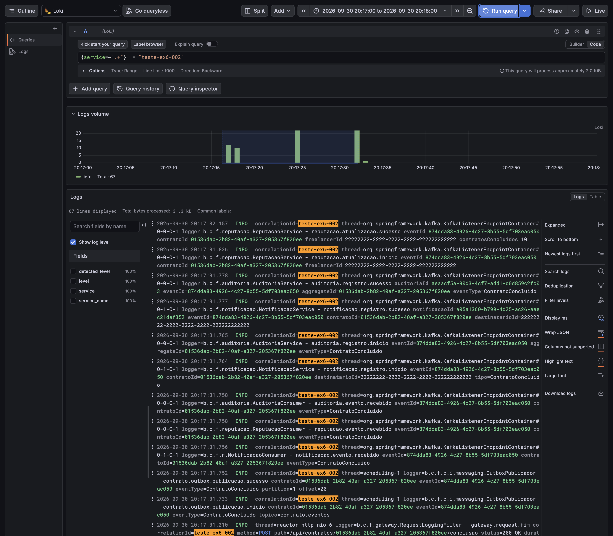
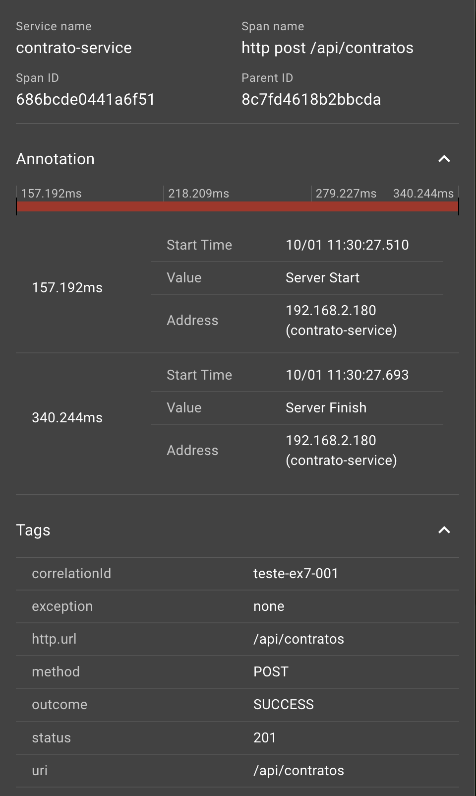
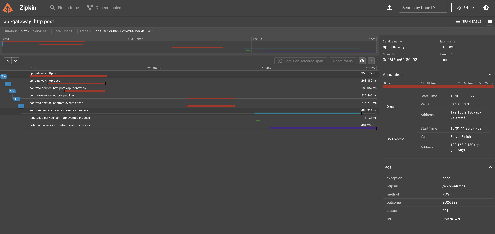

# Freela Marketplace

Projeto de referência para um marketplace de contratação de freelancers, construído com arquitetura de microsserviços em Java e Spring.

Clientes contratam freelancers para a execução de trabalhos. O núcleo do sistema é o gerenciamento dos contratos firmados entre as partes. A partir desse domínio, outros serviços mantêm notificações, reputação e auditoria.

Os serviços se comunicam de forma **assíncrona, por eventos, através do Apache Kafka**, sem chamadas HTTP entre o serviço de contratos e os consumidores. A solução inclui publicação transacional (Outbox), consumidores idempotentes, processamento concorrente com ordem preservada por contrato, tratamento de falhas com Dead Letter Topic, logs centralizados (Loki e Grafana) e rastreamento distribuído (Zipkin).

## Sumário

1. [Visão geral da arquitetura](#1-visão-geral-da-arquitetura)
2. [Serviços e infraestrutura](#2-serviços-e-infraestrutura)
3. [Domínio e API HTTP](#3-domínio-e-api-http)
4. [Comunicação por eventos](#4-comunicação-por-eventos)
5. [Observabilidade](#5-observabilidade)
6. [Como executar](#6-como-executar)
7. [Exemplos de chamadas](#7-exemplos-de-chamadas)
8. [Testes](#8-testes)
9. [Evidências da execução](#9-evidências-da-execução)
10. [Decisões e limitações](#10-decisões-e-limitações)
11. [Tecnologias](#11-tecnologias)

---

## 1. Visão geral da arquitetura

```text
                          +-------------------+
                          |      Cliente      |
                          +---------+---------+
                                    | HTTP (X-Correlation-Id opcional)
                                    v
                          +-------------------+
                          |    API Gateway    |  gera o correlationId se ausente
                          |       :8080       |
                          +---------+---------+
                                    | HTTP (descoberta via Eureka :8761)
                                    v
                          +-------------------+        +-------------------+
                          | contrato-service  | -----> |    PostgreSQL     |
                          |       :8081       |  (1)   |   contrato_db     |
                          |                   |        | contratos         |
                          |                   |        | outbox_eventos    |
                          +---------+---------+        +-------------------+
                                    | (2) publicador da outbox (polling de 1 s)
                                    v
                          +------------------------+
                          |         Kafka          |
                          | contrato.eventos  (3p) |
                          | contrato.eventos-dlt   |
                          +----+------+-------+----+
                               |      |       |
             +-----------------+      |       +------------------+
             v                        v                          v
   +--------------------+   +--------------------+   +----------------------+
   | notificacao-service|   | reputacao-service  |   | auditoria-service    |
   |       :8082        |   |       :8083        |   |        :8084         |
   |   notificacao_db   |   |   reputacao_db     |   |    auditoria_db      |
   +--------------------+   +--------------------+   +----------------------+

   Em todos os serviços:
   logs   ---> Loki :3100 ---> Grafana :3000
   traces ---> Zipkin :9411
```

Fluxo de uma operação:

1. O cliente chama o API Gateway, que encaminha a requisição ao `contrato-service`. O Gateway gera um `X-Correlation-Id` se o cliente não enviou.
2. O `contrato-service` altera o contrato e grava o evento correspondente na tabela `outbox_eventos`, **na mesma transação**.
3. Um publicador lê a outbox e publica o evento no tópico `contrato.eventos`, usando o `contratoId` como chave.
4. `notificacao-service`, `reputacao-service` e `auditoria-service` consomem o evento, cada um no seu grupo de consumo, e persistem o resultado no próprio banco. Cada um reconhece mensagens repetidas pelo `eventId`.
5. Se um consumidor falha, a mensagem é retentada e, esgotadas as tentativas, vai para o tópico `contrato.eventos-dlt`.

---

## 2. Serviços e infraestrutura

### Aplicações

| Aplicação | Porta | Banco | Responsabilidade |
|---|---:|---|---|
| `eureka-server` | 8761 | - | registro e descoberta dos serviços |
| `api-gateway` | 8080 | - | ponto de entrada HTTP; gera e propaga o `X-Correlation-Id` |
| `contrato-service` | 8081 | `contrato_db` | ciclo de vida dos contratos; **produtor** dos eventos |
| `notificacao-service` | 8082 | `notificacao_db` | registra notificações; **consumidor** |
| `reputacao-service` | 8083 | `reputacao_db` | mantém contratos concluídos e valor total por freelancer; **consumidor** |
| `auditoria-service` | 8084 | `auditoria_db` | registra todos os eventos da plataforma; **consumidor** |

### Infraestrutura local (`infra/docker-compose.yml`)

| Componente | Container | Porta | Uso |
|---|---|---:|---|
| PostgreSQL 16 | `freela-postgres` | 5432 | uma instância, quatro bancos (um por serviço) |
| Apache Kafka 4.2.1 (KRaft) | `freela-kafka` | 9092 | broker de mensagens |
| Kafka UI | `freela-kafka-ui` | 8090 | inspeção de tópicos e mensagens |
| Loki 3.7.3 | `freela-loki` | 3100 | armazenamento dos logs |
| Grafana 13.0.9 | `freela-grafana` | 3000 | consulta dos logs (fonte Loki já configurada) |
| Zipkin 3.6 | `freela-zipkin` | 9411 | consulta dos traces |

Acesso ao Kafka: aplicações na máquina usam `localhost:9092`; aplicações dentro da rede Docker usam `kafka:19092`.

---

## 3. Domínio e API HTTP

O domínio principal está no `contrato-service`, organizado em `application`, `domain` (`event`, `model`, `repository`, `shared`) e `infrastructure` (`persistence`, `web`, `messaging`).

Um contrato possui identificador, cliente, freelancer, título, valor, status e data de criação. Estados e transições:

```text
ATIVO ---------------> ENTREGA_REGISTRADA ---------------> CONCLUIDO
  |
  +--------------------> CANCELADO
```

Regras:

- só um contrato `ATIVO` recebe a entrega;
- só um contrato com a entrega registrada pode ser concluído;
- **só um contrato `ATIVO` pode ser cancelado**;
- cada transição gera um evento de domínio, gravado na outbox.

### Recursos HTTP (pelo Gateway, porta 8080)

| Método | Caminho | Efeito | Respostas |
|---|---|---|---|
| POST | `/api/contratos` | cria o contrato (`ATIVO`) | 201; 400 dados inválidos |
| POST | `/api/contratos/{id}/entrega` | `ATIVO` para `ENTREGA_REGISTRADA` | 200; 404; 409 |
| POST | `/api/contratos/{id}/conclusao` | `ENTREGA_REGISTRADA` para `CONCLUIDO` | 200; 404; 409 |
| POST | `/api/contratos/{id}/cancelamento` | `ATIVO` para `CANCELADO` | 200; 404; 409 |
| GET | `/api/contratos/{id}` | consulta um contrato | 200; 404 |
| GET | `/api/contratos` | lista os contratos | 200 |
| GET | `/api/notificacoes` | lista as notificações | 200 |
| GET | `/api/reputacoes` | lista a reputação por freelancer | 200 |
| GET | `/api/auditoria` | lista os eventos auditados | 200 |

Transição inválida responde `409 Conflict`, contrato inexistente `404 Not Found` e dado inválido `400 Bad Request`, no formato `application/problem+json`.

Exemplo de corpo para criar um contrato:

```json
{
  "clienteId": "11111111-1111-1111-1111-111111111111",
  "freelancerId": "22222222-2222-2222-2222-222222222222",
  "titulo": "Construção de API de pagamentos",
  "valor": 3500.00
}
```

---

## 4. Comunicação por eventos

### 4.1 Tópicos Kafka

| Tópico | Partições | Produtor | Consumidores | Finalidade |
|---|---:|---|---|---|
| `contrato.eventos` | 3 | `contrato-service` | `notificacao-service`, `reputacao-service`, `auditoria-service` (um grupo de consumo cada) | eventos do ciclo de vida do contrato |
| `contrato.eventos-dlt` | 3 | cada consumidor, quando esgota as tentativas | nenhum (diagnóstico e reprocessamento) | mensagens que não puderam ser processadas |

Os dois tópicos são criados pelo `contrato-service` na inicialização, com 3 partições e fator de replicação 1 (ambiente local de um único broker). O nome `contrato.eventos-dlt` segue o sufixo padrão do Spring Kafka. Cada mensagem vai para a mesma partição que tinha no tópico original, por isso o DLT também tem 3 partições.

Um único tópico para todos os eventos do contrato é deliberado: a ordem só é garantida dentro de uma partição de um mesmo tópico. Com um tópico por tipo de evento, `ContratoConcluido` poderia ser consumido antes de `EntregaRegistrada`.

Grupos de consumo: `notificacao-service`, `reputacao-service` e `auditoria-service`, todos com `auto-offset-reset: earliest`.

### 4.2 Formato da mensagem (envelope)

Chave Kafka: `contratoId`, como texto. Valor: JSON em texto (serializadores `String`).

| Campo | Tipo | Obrigatório | Descrição |
|---|---|---|---|
| `eventId` | UUID | sim | identificador único do evento; base da idempotência |
| `eventType` | texto | sim | `ContratoCriado`, `EntregaRegistrada`, `ContratoConcluido` ou `ContratoCancelado` |
| `contratoId` | UUID | sim | contrato relacionado; é também a chave da mensagem |
| `occurredAt` | texto ISO-8601 (UTC) | sim | momento em que o evento ocorreu no domínio |
| `correlationId` | texto | sim, na prática | identificação da operação, preenchida em toda requisição HTTP |
| `payload` | objeto | sim | dados específicos de cada evento (seção 4.3) |

O contexto do trace distribuído viaja nos **headers** da mensagem Kafka, e não no corpo.

### 4.3 Especificação dos eventos

Todos os eventos têm: **tópico** `contrato.eventos`, **produtor** `contrato-service` e **chave** `contratoId`. As colunas de payload abaixo são do campo `payload` do envelope.

#### ContratoCriado

- Disparado por: `POST /api/contratos`.
- Consumidores: `notificacao-service` (notifica o **freelancer**: "Novo contrato: título"), `auditoria-service` (registra), `reputacao-service` (recebe e ignora).

| Campo do payload | Tipo | Obrigatório |
|---|---|---|
| `clienteId` | UUID | sim |
| `freelancerId` | UUID | sim |
| `titulo` | texto | sim |
| `valor` | decimal positivo | sim |

```json
{
  "eventId": "6fdf69c7-9b16-4b8d-a683-bc2eaa791402",
  "eventType": "ContratoCriado",
  "contratoId": "772e9fcb-cf12-4fc0-ac13-1a12843ae5e3",
  "occurredAt": "2026-09-30T00:22:34.096141Z",
  "correlationId": "teste-ex2-001",
  "payload": {
    "clienteId": "11111111-1111-1111-1111-111111111111",
    "freelancerId": "22222222-2222-2222-2222-222222222222",
    "titulo": "API de pagamentos",
    "valor": 3500.00
  }
}
```

#### EntregaRegistrada

- Disparado por: `POST /api/contratos/{id}/entrega`.
- Consumidores: `notificacao-service` (notifica o **cliente**: "Entrega registrada no contrato: título"), `auditoria-service` (registra), `reputacao-service` (recebe e ignora).

| Campo do payload | Tipo | Obrigatório |
|---|---|---|
| `clienteId` | UUID | sim |
| `freelancerId` | UUID | sim |
| `titulo` | texto | sim |

```json
{
  "eventId": "45fb4064-33d6-4507-b858-04bbe183e1cd",
  "eventType": "EntregaRegistrada",
  "contratoId": "772e9fcb-cf12-4fc0-ac13-1a12843ae5e3",
  "occurredAt": "2026-09-30T00:22:41.438977Z",
  "correlationId": "teste-ex2-001",
  "payload": {
    "clienteId": "11111111-1111-1111-1111-111111111111",
    "freelancerId": "22222222-2222-2222-2222-222222222222",
    "titulo": "API de pagamentos"
  }
}
```

#### ContratoConcluido

- Disparado por: `POST /api/contratos/{id}/conclusao`.
- Consumidores: `reputacao-service` (**incrementa** `contratosConcluidos` e soma o `valor` em `valorTotal` do freelancer), `notificacao-service` (notifica o **freelancer**: "Contrato concluído: título"), `auditoria-service` (registra).

| Campo do payload | Tipo | Obrigatório |
|---|---|---|
| `clienteId` | UUID | sim |
| `freelancerId` | UUID | sim |
| `titulo` | texto | sim |
| `valor` | decimal positivo | sim |

```json
{
  "eventId": "e5c2ac4b-7dfc-4a94-aa38-e6203ef3ad84",
  "eventType": "ContratoConcluido",
  "contratoId": "772e9fcb-cf12-4fc0-ac13-1a12843ae5e3",
  "occurredAt": "2026-09-30T00:22:49.139034Z",
  "correlationId": "teste-ex2-001",
  "payload": {
    "clienteId": "11111111-1111-1111-1111-111111111111",
    "freelancerId": "22222222-2222-2222-2222-222222222222",
    "titulo": "API de pagamentos",
    "valor": 3500.00
  }
}
```

#### ContratoCancelado

- Disparado por: `POST /api/contratos/{id}/cancelamento`.
- Consumidores: `notificacao-service` (notifica o **freelancer**: "Contrato cancelado: título"), `auditoria-service` (registra), `reputacao-service` (recebe e ignora).

| Campo do payload | Tipo | Obrigatório |
|---|---|---|
| `clienteId` | UUID | sim |
| `freelancerId` | UUID | sim |
| `titulo` | texto | sim |

Exemplo ilustrativo (o `correlationId` é fictício):

```json
{
  "eventId": "56a95f3e-b5f1-4ace-972d-0a3bdf1f0988",
  "eventType": "ContratoCancelado",
  "contratoId": "024a9a4c-845c-4511-9b98-4d80d4c4cd75",
  "occurredAt": "2026-09-29T23:07:33.493260Z",
  "correlationId": "exemplo-cancelamento-001",
  "payload": {
    "clienteId": "11111111-1111-1111-1111-111111111111",
    "freelancerId": "22222222-2222-2222-2222-222222222222",
    "titulo": "Landing page"
  }
}
```

#### Campos que cada consumidor exige

| Consumidor | Campos lidos |
|---|---|
| `notificacao-service` | `eventId`, `contratoId`, `eventType`, `correlationId` e, do payload, `clienteId`, `freelancerId` e `titulo` |
| `reputacao-service` | `eventId`, `contratoId`, `eventType`, `correlationId` e, só no `ContratoConcluido`, `freelancerId` e `valor` |
| `auditoria-service` | `eventId`, `contratoId`, `eventType`, `correlationId` e `occurredAt`; guarda a mensagem inteira |

Uma mensagem que não seja JSON válido, ou sem um campo exigido, faz o consumidor falhar e segue o fluxo da seção 4.8.

### 4.4 Particionamento e ordenação

| Item | Configuração |
|---|---|
| Chave da mensagem | `contratoId` |
| Partições de `contrato.eventos` | 3 |
| Concorrência dos consumidores | `spring.kafka.listener.concurrency: 3` em cada serviço consumidor |
| Garantias do produtor | `acks=all`, `enable.idempotence=true` |

- Eventos do **mesmo contrato** têm a mesma chave, então caem na **mesma partição** e são lidos por **uma única thread**, na ordem em que foram publicados.
- Eventos de **contratos diferentes** se distribuem pelas 3 partições e são processados **em paralelo**, por até 3 threads de cada consumidor.
- O publicador da outbox lê as mensagens em ordem crescente de `id` e envia uma por vez, esperando a confirmação do broker. Se um envio falha, o lote para, para que uma mensagem posterior não ultrapasse a anterior.

O paralelismo máximo é o número de partições.

### 4.5 Idempotência

Cada evento nasce com um `eventId` único (UUID). Os consumidores com persistência usam esse identificador para reconhecer mensagens já processadas. A verificação e a gravação acontecem **na mesma transação**.

| Serviço | Onde fica o controle | Comportamento ao receber o mesmo evento de novo |
|---|---|---|
| `notificacao-service` | coluna `event_id` única em `notificacoes` | `notificacao.registro.duplicado` (WARN) e nenhuma nova notificação |
| `reputacao-service` | tabela `eventos_processados` (chave `event_id`) | `reputacao.atualizacao.duplicado` (WARN) e nenhum novo incremento |
| `auditoria-service` | coluna `event_id` única em `auditoria_eventos` | `auditoria.registro.duplicado` (WARN) e nenhum novo registro |

Como o mesmo evento tem sempre a mesma chave, as repetições chegam à mesma partição e à mesma thread, uma depois da outra. As restrições de unicidade no banco são a proteção final.

### 4.6 Publicação transacional (Outbox)

Para que gravar o contrato e publicar o evento não dependam de duas operações separadas, o `contrato-service` usa o padrão **Outbox**:

1. O serviço de aplicação altera o contrato e chama `OutboxRepository.registrar` dentro da mesma `@Transactional`. O método usa `Propagation.MANDATORY`, então falha se for chamado fora de uma transação.
2. A tabela `outbox_eventos` recebe uma linha por evento, com `event_id` único, `contrato_id`, `event_type`, o tópico, o `correlation_id`, o contexto do trace (`trace_context`), o envelope JSON completo (`payload`) e as datas de criação e de publicação (`publicado_em`, vazia enquanto pendente).
3. O `OutboxPublicador` roda a cada 1 segundo (`freela.outbox.intervalo-ms`), lê até 50 linhas pendentes em ordem de `id`, envia cada uma ao Kafka esperando a confirmação (até 15 s) e só então preenche `publicado_em`.
4. Se o Kafka estiver fora do ar, o contrato continua sendo criado e o evento fica pendente. Quando o broker volta, o publicador envia.

Configuração do produtor: `acks=all`, `enable.idempotence=true`, `max.in.flight.requests.per.connection=5`, `max.block.ms=5000`, `request.timeout.ms=5000` e `delivery.timeout.ms=10000`. Os timeouts curtos fazem uma indisponibilidade do Kafka falhar em segundos.

A entrega é **pelo menos uma vez** (*at-least-once*): se o serviço cair entre a confirmação do broker e o preenchimento de `publicado_em`, o evento é publicado de novo. A idempotência dos consumidores absorve a repetição.

### 4.7 Tratamento de falhas

Cada consumidor usa um `DefaultErrorHandler` com `FixedBackOff(1000 ms, 3 tentativas)` e um `DeadLetterPublishingRecoverer`:

- a mensagem com erro é tentada **4 vezes** (a entrega inicial e 3 retentativas), com cerca de 1 segundo entre elas;
- cada tentativa registra `<servico>.consumo.falha` (WARN) com `topico`, `partition`, `offset` e o número da `tentativa`;
- esgotadas as tentativas, a mensagem vai para `contrato.eventos-dlt`, na mesma partição de origem, e é registrado `<servico>.consumo.dlt` (ERROR);
- o consumidor segue para a próxima mensagem.

Enquanto uma mensagem é retentada (cerca de 3 s), só a partição dela espera. As outras continuam. Como os três serviços leem o mesmo tópico, uma mensagem inválida gera **uma cópia no DLT por serviço**, identificada pelo header `kafka_dlt-original-consumer-group`.

As mensagens no DLT trazem headers de diagnóstico: `kafka_dlt-original-topic`, `kafka_dlt-original-partition`, `kafka_dlt-original-offset`, `kafka_dlt-original-consumer-group`, `kafka_dlt-exception-fqcn`, `kafka_dlt-exception-cause-fqcn`, `kafka_dlt-exception-message` e `kafka_dlt-exception-stacktrace`.

Reprocessamento: depois de corrigir a causa, a mensagem pode ser publicada de novo em `contrato.eventos`. Como os consumidores são idempotentes, quem já a processou a ignora. Esse reenvio é **manual** (não há ferramenta nem teste automatizado para ele).

---

## 5. Observabilidade

### 5.1 Correlação das operações

Uma operação iniciada externamente recebe uma identificação única, o `correlationId`, que acompanha todo o processamento:

```text
Cliente --X-Correlation-Id--> API Gateway --> contrato-service --> Kafka --> consumidores
```

| Etapa | Como o `correlationId` é tratado |
|---|---|
| API Gateway | usa o header `X-Correlation-Id` recebido ou gera um UUID; repassa ao serviço de destino e o registra em `gateway.request.inicio` e `gateway.request.fim` |
| `contrato-service` (HTTP) | o `CorrelationIdFilter` coloca o valor no MDC, devolve o header na resposta e marca o span do trace com a tag `correlationId` |
| Outbox | o valor do MDC é gravado na mensagem (`correlationId` do envelope) |
| Publicador | coloca o `correlationId` da mensagem no MDC a cada envio |
| Consumidores | leem o `correlationId` do envelope e o colocam no MDC durante o processamento |

### 5.2 Logs da aplicação

Todos os serviços usam o mesmo padrão de linha (o Gateway registra o `correlationId` na própria mensagem):

```text
%d{yyyy-MM-dd HH:mm:ss.SSS} %-5level service=<serviço> correlationId=<id|n/a> thread=<thread> logger=<logger> - <evento> chave=valor ...
```

Exemplo:

```text
2026-09-30 14:24:10.307 INFO  service=contrato-service correlationId=teste-ex5-001 thread=scheduling-1 logger=b.c.f.c.i.messaging.OutboxPublicador - contrato.outbox.publicacao.sucesso contratoId=765c8421-cdc3-46a2-8b95-444d5bec85cd eventId=df41984e-3b95-4361-b8da-0dbc8f457d8f eventType=ContratoCriado partition=2 offset=7
```

Convenções:

- nome do evento de log no formato `dominio.acao.etapa` (por exemplo `contrato.criacao.inicio`, `notificacao.registro.sucesso`, `reputacao.atualizacao.duplicado`), seguido de pares `chave=valor`;
- `correlationId` impresso em todas as linhas pelo MDC; fora de uma requisição ou mensagem aparece `n/a`;
- os logs cobrem início e conclusão do processamento, mensagens recebidas e publicadas, duplicidades e falhas;
- **dados sensíveis não são registrados**: título e valor do contrato ficam fora dos logs, que trazem só identificadores, tipo de evento e status.

### 5.3 Logs centralizados (Loki e Grafana)

- Cada serviço (inclusive o Gateway) envia seus logs diretamente ao Loki, pelo appender `loki-logback-appender` (2.0.3), configurado em `src/main/resources/logback-spring.xml`. O console continua mostrando tudo.
- Só os logs do pacote `br.com.freela` vão ao Loki, o que deixa de fora o ruído do Eureka, do Hibernate e do Kafka.
- Labels indexados: `service` e `level`. O `contratoId`, o `eventId` e o `correlationId` ficam no texto da linha e são buscados por filtro de texto.
- O envio é em lotes de até 2 segundos (`batch.timeoutMs`). O endereço do Loki pode ser trocado pela variável `LOKI_URL`.
- O Grafana sobe com o Loki já cadastrado como fonte de dados (`infra/grafana/datasources.yml`) e com acesso anônimo, **apenas para uso local**.

Consultas no Grafana (`http://localhost:3000/explore`, fonte `Loki`, modo **Code**):

```text
{service=~".+"} |= "<correlationId>"
{service=~".+"} |= "<contratoId>"
{service=~".+"} |= "<eventId>"
{service="notificacao-service"} |= "<correlationId>"
```

Pela API do Loki, em texto:

```bash
curl -s -G http://localhost:3100/loki/api/v1/query_range \
  --data-urlencode 'query={service=~".+"} |= "<correlationId>"' \
  --data-urlencode 'since=6h' \
  --data-urlencode 'limit=200' \
  --data-urlencode 'direction=forward' \
  | jq -r '.data.result[] | .stream.service as $s | .values[] | "\(.[0]) \($s) \(.[1])"' | sort
```

### 5.4 Rastreamento distribuído (Zipkin)

- Dependência `spring-boot-starter-zipkin` (Micrometer Tracing com Brave) nos cinco serviços de negócio.
- `management.tracing.sampling.probability: 1.0` (100% das requisições) e `management.tracing.export.zipkin.endpoint: ${ZIPKIN_URL:http://localhost:9411/api/v2/spans}`.
- O Gateway abre o trace e repassa o contexto ao `contrato-service` nos headers HTTP.
- **Kafka:** a observação do `KafkaTemplate` (`spring.kafka.template.observation-enabled`, no contrato) e dos listeners (`spring.kafka.listener.observation-enabled`, nos consumidores) propaga o contexto nos headers da mensagem e cria os spans de envio e de recebimento.
- **Contexto através da Outbox:** o evento só é publicado depois, numa thread de agendamento, fora da requisição. Por isso o `contrato-service` grava o contexto do trace na coluna `trace_context` ao registrar o evento e o restaura no publicador, que envia a mensagem dentro de um span `outbox.publicar`. Sem isso, a publicação abriria um trace novo e a cadeia se quebraria.
- O trace da tarefa agendada da outbox (que roda a cada segundo) é desligado com `management.observations.enable.tasks.scheduled.execution: false`, para não encher o Zipkin.

Para ver um trace: `http://localhost:9411`, adicione o filtro `tagQuery` `correlationId=<id>` e clique em **Run Query**.

---

## 6. Como executar

Requisitos: Java 21, Maven, Docker (com o Docker Compose) e `jq` (opcional, para os exemplos).

### 6.1 Infraestrutura

```bash
cd infra
docker compose up -d
docker compose ps
```

Esperado: `postgres` e `kafka` como `healthy`, e `kafka-ui`, `loki`, `grafana` e `zipkin` como `Up`. O Kafka leva cerca de 30 segundos. O script `infra/postgres/init-databases.sql` cria os quatro bancos na primeira subida.

Para conferir:

```bash
docker exec freela-postgres pg_isready -U freela
curl -s http://localhost:3100/ready
curl -s http://localhost:9411/health
```

Para encerrar: `docker compose down`. Para remover também os dados do PostgreSQL: `docker compose down -v`. O Loki e o Zipkin não usam volume, então perdem os dados quando seus containers são removidos.

### 6.2 Aplicações

Suba nesta ordem, esperando o `Started ...Application` de cada uma (pelo IntelliJ ou com `mvn -pl <módulo> spring-boot:run` na raiz):

1. `eureka-server`
2. `contrato-service` (cria os tópicos do Kafka)
3. `notificacao-service`
4. `reputacao-service`
5. `auditoria-service`
6. `api-gateway`

```bash
mvn -pl eureka-server spring-boot:run
mvn -pl contrato-service spring-boot:run
mvn -pl notificacao-service spring-boot:run
mvn -pl reputacao-service spring-boot:run
mvn -pl auditoria-service spring-boot:run
mvn -pl api-gateway spring-boot:run
```

Depois do `Started`, o registro no Eureka leva até uns 30 segundos. Antes disso o Gateway responde `503`. Para conferir que tudo está no ar:

```bash
for p in 8761 8080 8081 8082 8083 8084; do echo -n "$p: "; curl -s -o /dev/null -w "%{http_code}\n" http://localhost:$p/actuator/health; done
```

### 6.3 Interfaces

| Interface | Endereço |
|---|---|
| Eureka | `http://localhost:8761` |
| Kafka UI | `http://localhost:8090` |
| Grafana (logs) | `http://localhost:3000` |
| Zipkin (traces) | `http://localhost:9411` |

---

## 7. Exemplos de chamadas

### 7.1 Gerar o ciclo completo de eventos

```bash
ID=$(curl -s -X POST http://localhost:8080/api/contratos \
  -H 'Content-Type: application/json' -H 'X-Correlation-Id: demo-001' \
  -d '{"clienteId":"11111111-1111-1111-1111-111111111111","freelancerId":"22222222-2222-2222-2222-222222222222","titulo":"API de pagamentos","valor":3500.00}' | jq -r .id)

curl -s -X POST http://localhost:8080/api/contratos/$ID/entrega   -H 'X-Correlation-Id: demo-001'
curl -s -X POST http://localhost:8080/api/contratos/$ID/conclusao -H 'X-Correlation-Id: demo-001'
echo $ID
```

Para um contrato cancelado, crie outro e chame `POST /api/contratos/{id}/cancelamento` (só funciona enquanto estiver `ATIVO`).

### 7.2 Consultar os resultados nos consumidores

```bash
curl -s http://localhost:8080/api/notificacoes | jq
curl -s http://localhost:8080/api/reputacoes   | jq
curl -s http://localhost:8080/api/auditoria    | jq
```

### 7.3 Ver as mensagens no Kafka

```bash
docker exec freela-kafka /opt/kafka/bin/kafka-console-consumer.sh --bootstrap-server localhost:9092 \
  --topic contrato.eventos --from-beginning \
  --formatter-property print.key=true --formatter-property print.partition=true
```

### 7.4 Ver a outbox

```bash
docker exec freela-postgres psql -U freela -d contrato_db \
  -c "select id, event_type, contrato_id, correlation_id, publicado_em from outbox_eventos order by id;"
```

### 7.5 Publicação com o Kafka parado

```bash
cd infra && docker compose stop kafka && cd ..
curl -i -X POST http://localhost:8080/api/contratos \
  -H 'Content-Type: application/json' -H 'X-Correlation-Id: demo-kafka-fora' \
  -d '{"clienteId":"11111111-1111-1111-1111-111111111111","freelancerId":"22222222-2222-2222-2222-222222222222","titulo":"Contrato com Kafka fora","valor":100.00}'
# o contrato é criado (201) e a linha da outbox fica com publicado_em vazio
cd infra && docker compose start kafka && cd ..
# em alguns segundos o evento é publicado e publicado_em é preenchido
```

### 7.6 Mensagem duplicada

Pare `notificacao-service`, `reputacao-service` e `auditoria-service`, volte os offsets ao início e suba os três de novo:

```bash
for g in notificacao-service reputacao-service auditoria-service; do
  docker exec freela-kafka /opt/kafka/bin/kafka-consumer-groups.sh --bootstrap-server localhost:9092 \
    --group $g --topic contrato.eventos --reset-offsets --to-earliest --execute
done
```

Todos os eventos são lidos de novo e aparecem como `*.duplicado`, sem alterar as notificações, a reputação ou a auditoria.

### 7.7 Mensagem inválida e Dead Letter Topic

```bash
echo 'mensagem-invalida' | docker exec -i freela-kafka /opt/kafka/bin/kafka-console-producer.sh \
  --bootstrap-server localhost:9092 --topic contrato.eventos

docker exec freela-kafka /opt/kafka/bin/kafka-console-consumer.sh --bootstrap-server localhost:9092 \
  --topic contrato.eventos-dlt --from-beginning --timeout-ms 5000 \
  --formatter-property print.headers=true --formatter-property print.partition=true
```

---

## 8. Testes

Os testes ficam em `src/test` de cada módulo. Os de integração usam **Testcontainers**, com Kafka e PostgreSQL reais, nas mesmas imagens do Compose (`apache/kafka:4.2.1` e `postgres:16`). O Docker precisa estar rodando.

```bash
mvn test
```

| Módulo | Classe | Testes | O que cobre |
|---|---|---:|---|
| `contrato-service` | `ContratoTest` | 8 | transições, regra de cancelamento, eventos gerados na ordem e com `eventId` único |
| `contrato-service` | `PublicacaoDeEventosTest` | 2 | **producer:** chave, partição, ordem e envelope dos eventos publicados; regra violada não grava evento na outbox |
| `notificacao-service` | `NotificacaoConsumerTest` | 1 | **consumer e duplicidade:** mensagem repetida gera uma só notificação |
| `reputacao-service` | `ReputacaoConsumerTest` | 1 | **duplicidade:** mensagem repetida não incrementa a reputação duas vezes |
| `auditoria-service` | `AuditoriaConsumerTest` | 2 | **duplicidade** e **ordenação** por contrato com consumo concorrente |

Nos testes de duplicidade, são enviados `A`, `A` (repetido) e `B` com a mesma chave. Como a mesma chave cai na mesma partição, o `B` só é processado depois do segundo `A`. O teste espera o `B` e então confere os números, sem pausa fixa.

---

## 9. Evidências da execução

Os trechos abaixo vêm das execuções reais do ambiente, entre 29/09 e 01/10/2026. As imagens ficam em `docs/imagens/`.

### 9.1 Requisição recebida pelo API Gateway

```text
2026-09-30 14:24:09.076 INFO  service=api-gateway thread=reactor-http-nio-2 logger=b.c.f.gateway.RequestLoggingFilter - gateway.request.inicio correlationId=teste-ex5-001 method=POST path=/api/contratos
2026-09-30 14:24:09.529 INFO  service=api-gateway thread=reactor-http-nio-2 logger=b.c.f.gateway.RequestLoggingFilter - gateway.request.fim correlationId=teste-ex5-001 method=POST path=/api/contratos status=201 CREATED durationMs=456 signal=onComplete
```

### 9.2 Alteração persistida no `contrato-service` e evento gravado na outbox

```text
2026-09-30 14:24:09.403 INFO  service=contrato-service correlationId=teste-ex5-001 thread=http-nio-8081-exec-1 logger=b.c.f.c.i.p.ContratoRepositoryJpaAdapter - contrato.persistence.save.inicio contratoId=765c8421-cdc3-46a2-8b95-444d5bec85cd status=ATIVO
2026-09-30 14:24:09.464 INFO  service=contrato-service correlationId=teste-ex5-001 thread=http-nio-8081-exec-1 logger=b.c.f.c.i.p.ContratoRepositoryJpaAdapter - contrato.persistence.save.sucesso contratoId=765c8421-cdc3-46a2-8b95-444d5bec85cd status=ATIVO
2026-09-30 14:24:09.502 INFO  service=contrato-service correlationId=teste-ex5-001 thread=http-nio-8081-exec-1 logger=b.c.f.c.i.p.OutboxRepositoryJpaAdapter - contrato.outbox.registro.sucesso contratoId=765c8421-cdc3-46a2-8b95-444d5bec85cd eventId=df41984e-3b95-4361-b8da-0dbc8f457d8f eventType=ContratoCriado
```

O contrato e o evento são gravados na mesma transação, na mesma thread de requisição.

### 9.3 Evento publicado no Kafka

Publicação pelo publicador da outbox, com partição e offset:

```text
2026-09-30 14:24:10.307 INFO  service=contrato-service correlationId=teste-ex5-001 thread=scheduling-1 logger=b.c.f.c.i.messaging.OutboxPublicador - contrato.outbox.publicacao.sucesso contratoId=765c8421-cdc3-46a2-8b95-444d5bec85cd eventId=df41984e-3b95-4361-b8da-0dbc8f457d8f eventType=ContratoCriado partition=2 offset=7
```

Mensagens lidas no tópico (`kafka-console-consumer`, com chave e partição). Os três eventos do mesmo contrato ficam na **mesma partição (2)**, com a chave igual ao `contratoId`:

```text
Partition:2     772e9fcb-cf12-4fc0-ac13-1a12843ae5e3    {"eventId":"6fdf69c7-9b16-4b8d-a683-bc2eaa791402","eventType":"ContratoCriado","contratoId":"772e9fcb-cf12-4fc0-ac13-1a12843ae5e3","occurredAt":"2026-09-30T00:22:34.096141Z","correlationId":"teste-ex2-001","payload":{"clienteId":"11111111-1111-1111-1111-111111111111","freelancerId":"22222222-2222-2222-2222-222222222222","titulo":"API de pagamentos","valor":3500.00}}
Partition:2     772e9fcb-cf12-4fc0-ac13-1a12843ae5e3    {"eventId":"45fb4064-33d6-4507-b858-04bbe183e1cd","eventType":"EntregaRegistrada","contratoId":"772e9fcb-cf12-4fc0-ac13-1a12843ae5e3","occurredAt":"2026-09-30T00:22:41.438977Z","correlationId":"teste-ex2-001","payload":{"clienteId":"11111111-1111-1111-1111-111111111111","freelancerId":"22222222-2222-2222-2222-222222222222","titulo":"API de pagamentos"}}
Partition:2     772e9fcb-cf12-4fc0-ac13-1a12843ae5e3    {"eventId":"e5c2ac4b-7dfc-4a94-aa38-e6203ef3ad84","eventType":"ContratoConcluido","contratoId":"772e9fcb-cf12-4fc0-ac13-1a12843ae5e3","occurredAt":"2026-09-30T00:22:49.139034Z","correlationId":"teste-ex2-001","payload":{"clienteId":"11111111-1111-1111-1111-111111111111","freelancerId":"22222222-2222-2222-2222-222222222222","titulo":"API de pagamentos","valor":3500.00}}
```

Descrição do tópico (3 partições):

```text
Topic: contrato.eventos TopicId: BrNM649TQaiFxcW1Y_Hrvw PartitionCount: 3       ReplicationFactor: 1    Configs: min.insync.replicas=1
        Topic: contrato.eventos Partition: 0    Leader: 1       Replicas: 1     Isr: 1
        Topic: contrato.eventos Partition: 1    Leader: 1       Replicas: 1     Isr: 1
        Topic: contrato.eventos Partition: 2    Leader: 1       Replicas: 1     Isr: 1
```

**Evento gravado na outbox e entregue.** O contrato `e3544c02-2fd4-4bd9-b81d-8d4c0089b157` ("Contrato com Kafka fora", `correlationId=teste-ex2-kafka-fora`) teve o evento `ContratoCriado` gravado na outbox (`contrato.outbox.registro.sucesso`) e entregue aos três consumidores: ele aparece na notificação, na auditoria e nos logs da reputação. O roteiro para reproduzir a indisponibilidade do Kafka está na seção 7.5.

### 9.4 Consumo pelos serviços interessados

Fluxo de três operações, vistas pelo Loki (`correlationId=teste-ex6-002`, contrato `01536dab-2b82-40af-a327-205367f820ee`). Horários em horário local; entre parênteses, partição e offset da publicação:

| Operação (eventId) | Gateway recebe | contrato publica (partição, offset) | notificacao recebe | reputacao recebe | auditoria recebe |
|---|---|---|---|---|---|
| `ContratoCriado` (`d4c898d1-6df1-47bf-9c67-782ac7cfb766`) | 20:17:16.269 | 20:17:17.394 (1, 18) | 20:17:17.461 | 20:17:17.456 | 20:17:17.468 |
| `EntregaRegistrada` (`b14b31d1-5a50-4d24-bc69-f185bbd32eee`) | 20:17:24.421 | 20:17:24.639 (1, 19) | 20:17:24.644 | 20:17:24.645 | 20:17:24.644 |
| `ContratoConcluido` (`874dda83-4926-4c27-8b55-5df703eac050`) | 20:17:31.167 | 20:17:31.752 (1, 20) | 20:17:31.756 | 20:17:31.758 | 20:17:31.758 |

Os três eventos foram publicados na mesma partição, com offsets consecutivos (18, 19 e 20).

### 9.5 Persistência realizada pelos consumidores

Exemplo de notificação (`GET /api/notificacoes`):

```json
{
  "contratoId": "772e9fcb-cf12-4fc0-ac13-1a12843ae5e3",
  "criadaEm": "2026-09-30T12:52:47.045772Z",
  "destinatarioId": "22222222-2222-2222-2222-222222222222",
  "eventId": "6fdf69c7-9b16-4b8d-a683-bc2eaa791402",
  "id": "b46ebfaf-e95b-4cb8-aa60-b4cee3d79642",
  "mensagem": "Novo contrato: API de pagamentos",
  "tipo": "ContratoCriado"
}
```

Reputação do freelancer (`GET /api/reputacoes`) depois de dois contratos concluídos (3500.00 e 1200.00):

```json
[
  {
    "contratosConcluidos": 2,
    "freelancerId": "22222222-2222-2222-2222-222222222222",
    "valorTotal": 4700.00
  }
]
```

Exemplo de registro de auditoria (`GET /api/auditoria`), com o `payload` abreviado aqui:

```json
{
  "aggregateId": "772e9fcb-cf12-4fc0-ac13-1a12843ae5e3",
  "correlationId": "teste-ex2-001",
  "eventId": "6fdf69c7-9b16-4b8d-a683-bc2eaa791402",
  "eventType": "ContratoCriado",
  "id": "9d795c66-2d47-4d78-98e9-50acc18465e7",
  "occurredAt": "2026-09-30T00:22:34.096141Z",
  "payload": "{ ...mensagem completa do evento... }",
  "recebidoEm": "2026-09-30T12:53:15.224458Z"
}
```

### 9.6 Tratamento de mensagem duplicada

Os offsets dos três grupos foram voltados ao início (`--reset-offsets --to-earliest`, seção 7.6), e os serviços releram os 7 eventos já processados. Cada um respondeu com `duplicado`, sem nenhum `sucesso` no reprocessamento:

```text
2026-09-30 09:59:54.739 WARN  service=notificacao-service thread=org.springframework.kafka.KafkaListenerEndpointContainer#0-0-C-1 logger=b.c.f.notificacao.NotificacaoService - notificacao.registro.duplicado eventId=45fb4064-33d6-4507-b858-04bbe183e1cd contratoId=772e9fcb-cf12-4fc0-ac13-1a12843ae5e3 destinatarioId=11111111-1111-1111-1111-111111111111
2026-09-30 10:00:05.257 WARN  service=reputacao-service thread=org.springframework.kafka.KafkaListenerEndpointContainer#0-0-C-1 logger=b.c.f.reputacao.ReputacaoService - reputacao.atualizacao.duplicado eventId=e5c2ac4b-7dfc-4a94-aa38-e6203ef3ad84 contratoId=772e9fcb-cf12-4fc0-ac13-1a12843ae5e3 freelancerId=22222222-2222-2222-2222-222222222222
2026-09-30 10:00:18.820 WARN  service=auditoria-service thread=org.springframework.kafka.KafkaListenerEndpointContainer#0-0-C-1 logger=b.c.f.auditoria.AuditoriaService - auditoria.registro.duplicado eventId=45fb4064-33d6-4507-b858-04bbe183e1cd aggregateId=772e9fcb-cf12-4fc0-ac13-1a12843ae5e3 eventType=EntregaRegistrada
```

A reputação também mostra o valor que seria somado (`valor=3500.0`) antes do `duplicado`: o duplicado interrompe a soma antes de alterar o freelancer. Os testes automatizados (seção 8) confirmam as contagens: a mensagem repetida resulta em uma notificação, uma linha de auditoria e um único incremento da reputação.

### 9.7 Ordem dos eventos de um mesmo contrato

Cinco contratos foram criados em paralelo, cada um com os três eventos, com 3 partições e `concurrency: 3`. Duas threads processaram contratos diferentes no mesmo milissegundo:

```text
2026-09-30 10:38:11.385 INFO  service=notificacao-service thread=org.springframework.kafka.KafkaListenerEndpointContainer#0-1-C-1 logger=b.c.f.n.NotificacaoConsumer - notificacao.evento.recebido eventId=a090573a-b571-4463-a6ee-cb0eb96b82ab contratoId=0aeddea5-8544-41dc-a14f-9f6d07318a1b eventType=ContratoCriado correlationId=teste-ex4-3
2026-09-30 10:38:11.385 INFO  service=notificacao-service thread=org.springframework.kafka.KafkaListenerEndpointContainer#0-0-C-1 logger=b.c.f.n.NotificacaoConsumer - notificacao.evento.recebido eventId=07cbd005-7b80-4cf5-9bec-7029b3133311 contratoId=b94d8b13-d1ca-417e-91f9-2b8d73c4d908 eventType=ContratoCriado correlationId=teste-ex4-4
```

Cada contrato foi sempre processado pela mesma thread, na sequência `ContratoCriado`, `EntregaRegistrada`, `ContratoConcluido`. A consulta na auditoria confirma a ordem de recebimento por contrato (15 registros, 5 contratos x 3 eventos):

```text
             aggregate_id             |    event_type     |          recebido_em
--------------------------------------+-------------------+-------------------------------
 0aeddea5-8544-41dc-a14f-9f6d07318a1b | ContratoCriado    | 2026-09-30 13:38:11.755754+00
 0aeddea5-8544-41dc-a14f-9f6d07318a1b | EntregaRegistrada | 2026-09-30 13:38:11.876006+00
 0aeddea5-8544-41dc-a14f-9f6d07318a1b | ContratoConcluido | 2026-09-30 13:38:11.901494+00
 4034de48-5b14-4cf3-b676-25e77a7d6548 | ContratoCriado    | 2026-09-30 13:38:11.852296+00
 4034de48-5b14-4cf3-b676-25e77a7d6548 | EntregaRegistrada | 2026-09-30 13:38:11.870979+00
 4034de48-5b14-4cf3-b676-25e77a7d6548 | ContratoConcluido | 2026-09-30 13:38:11.8971+00
 6b6d7375-e20f-4880-b71e-18d076636782 | ContratoCriado    | 2026-09-30 13:38:11.832501+00
 6b6d7375-e20f-4880-b71e-18d076636782 | EntregaRegistrada | 2026-09-30 13:38:11.880406+00
 6b6d7375-e20f-4880-b71e-18d076636782 | ContratoConcluido | 2026-09-30 13:38:11.892286+00
 b94d8b13-d1ca-417e-91f9-2b8d73c4d908 | ContratoCriado    | 2026-09-30 13:38:11.842074+00
 b94d8b13-d1ca-417e-91f9-2b8d73c4d908 | EntregaRegistrada | 2026-09-30 13:38:11.905151+00
 b94d8b13-d1ca-417e-91f9-2b8d73c4d908 | ContratoConcluido | 2026-09-30 13:38:11.909277+00
 dcd370f0-1e1b-40c8-b44c-77b42b8cf69d | ContratoCriado    | 2026-09-30 13:38:11.859857+00
 dcd370f0-1e1b-40c8-b44c-77b42b8cf69d | EntregaRegistrada | 2026-09-30 13:38:11.865734+00
 dcd370f0-1e1b-40c8-b44c-77b42b8cf69d | ContratoConcluido | 2026-09-30 13:38:11.885093+00
(15 rows)
```

### 9.8 Falha de processamento e Dead Letter Topic

Uma mensagem que não é JSON foi publicada em `contrato.eventos`. Os três serviços tentaram 4 vezes e enviaram a mensagem ao DLT. Log do `notificacao-service` (partição 1, offset 13):

```text
2026-09-30 12:51:47.257 WARN  service=notificacao-service thread=org.springframework.kafka.KafkaListenerEndpointContainer#0-1-C-1 logger=b.c.f.n.KafkaConsumerConfig - notificacao.consumo.falha contratoId=null topico=contrato.eventos partition=1 offset=13 tentativa=1 erro=Listener method 'public void br.com.freela.notificacao.NotificacaoConsumer.consumir(java.lang.String)' threw exception
2026-09-30 12:51:50.382 WARN  service=notificacao-service thread=org.springframework.kafka.KafkaListenerEndpointContainer#0-1-C-1 logger=b.c.f.n.KafkaConsumerConfig - notificacao.consumo.falha contratoId=null topico=contrato.eventos partition=1 offset=13 tentativa=4 erro=Listener method 'public void br.com.freela.notificacao.NotificacaoConsumer.consumir(java.lang.String)' threw exception
2026-09-30 12:51:51.003 ERROR service=notificacao-service thread=org.springframework.kafka.KafkaListenerEndpointContainer#0-1-C-1 logger=b.c.f.n.KafkaConsumerConfig - notificacao.consumo.dlt contratoId=null topico=contrato.eventos partition=1 offset=13 erro=Listener method 'public void br.com.freela.notificacao.NotificacaoConsumer.consumir(java.lang.String)' threw exception
```

(O `contratoId=null` aparece porque a mensagem de teste foi enviada sem chave.) O DLT tem 3 partições e recebeu 9 mensagens, 3 mensagens inválidas x 3 serviços, cada uma na partição de origem:

| Partição do DLT | Mensagem original | Grupos que falharam |
|---|---|---|
| 0 | `mensagem-invalida` | reputacao-service, auditoria-service, notificacao-service |
| 1 | `mensagem-invalida-2` | auditoria-service, notificacao-service, reputacao-service |
| 2 | `mensagem-invalida-3` | notificacao-service, auditoria-service, reputacao-service |

Headers de cada mensagem do DLT: `kafka_dlt-exception-cause-fqcn: tools.jackson.core.exc.StreamReadException`, `kafka_dlt-original-topic: contrato.eventos` e `kafka_dlt-original-consumer-group` (o grupo que falhou), entre outros.

**A falha não compromete mensagens válidas.** Logo depois, o contrato `82edf244-2d5e-419f-92cb-d83d1509d346` ("Depois da falha", `correlationId=teste-ex4-depois-da-falha`) foi criado e processado normalmente: a notificação foi registrada às 16:05:47.917Z e a auditoria às 16:05:47.913Z, cerca de 1,7 s depois da criação.

### 9.9 Logs da mesma operação consultados de forma centralizada

No Grafana (Explore, fonte Loki), com o filtro de texto `teste-ex6-002` no intervalo do fluxo (30/09, de 20:17:00 a 20:18:00), apareceram 67 linhas de serviços diferentes no mesmo resultado, todas com `correlationId=teste-ex6-002`. Na janela de 48 horas, o mesmo filtro devolve 75 linhas: as 8 a mais são de tentativas anteriores com o mesmo identificador, em que o Gateway registrou requisições que não chegaram a criar contrato.



A busca por `eventId` (`874dda83-4926-4c27-8b55-5df703eac050`) devolveu 14 linhas de 4 serviços, do registro na outbox até a reputação atualizada:

| Hora | Serviço | Linha de log |
|---|---|---|
| 20:17:31.192 | contrato-service | `contrato.outbox.registro.inicio` |
| 20:17:31.202 | contrato-service | `contrato.outbox.registro.sucesso` |
| 20:17:31.202 | contrato-service | `contrato.evento.registrado` |
| 20:17:31.733 | contrato-service | `contrato.outbox.publicacao.inicio` |
| 20:17:31.752 | contrato-service | `contrato.outbox.publicacao.sucesso` (partition=1, offset=20) |
| 20:17:31.756 | notificacao-service | `notificacao.evento.recebido` |
| 20:17:31.758 | reputacao-service | `reputacao.evento.recebido` |
| 20:17:31.758 | auditoria-service | `auditoria.evento.recebido` |
| 20:17:31.764 | notificacao-service | `notificacao.registro.inicio` |
| 20:17:31.765 | auditoria-service | `auditoria.registro.inicio` |
| 20:17:31.777 | notificacao-service | `notificacao.registro.sucesso` |
| 20:17:31.778 | auditoria-service | `auditoria.registro.sucesso` |
| 20:17:31.836 | reputacao-service | `reputacao.atualizacao.inicio` |
| 20:17:32.157 | reputacao-service | `reputacao.atualizacao.sucesso` (`contratosConcluidos=10`) |

A busca por `contratoId` (`01536dab-2b82-40af-a327-205367f820ee`) encontrou linhas nos cinco serviços: `api-gateway` 4, `contrato-service` 34, `notificacao-service` 9, `auditoria-service` 9 e `reputacao-service` 5.

### 9.10 Trace correspondente no Zipkin

O trace de uma criação de contrato (`6abe6e83c68fd60c3a26f6be64f80493`, 8 spans) liga o Gateway, o `contrato-service`, o envio ao Kafka e os três consumidores:

| # | Serviço: span | Duração |
|---|---|---|
| 1 | api-gateway: http post (raiz) | 350,522 ms |
| 2 | api-gateway: http post (chamada ao contrato-service) | 263,882 ms |
| 3 | contrato-service: http post /api/contratos | 183,052 ms |
| 4 | contrato-service: outbox.publicar | 217,462 ms |
| 5 | contrato-service: contrato.eventos send | 214,719 ms |
| 6 | auditoria-service: contrato.eventos process | 484,931 ms |
| 7 | reputacao-service: contrato.eventos process | 18,123 ms |
| 8 | notificacao-service: contrato.eventos process | 484,285 ms |



O span HTTP do contrato traz a tag `correlationId=teste-ex7-001`, o que permite buscar o trace pela correlação:



A duração total do trace (1,572 s) é maior que a resposta HTTP (cerca de 350 ms), porque o evento é publicado depois da resposta, no ciclo seguinte do publicador da outbox, e os consumidores processam em seguida. O span `outbox.publicar`, criado numa thread de agendamento, é filho do span HTTP: o contexto do trace atravessou a outbox.

### 9.11 Testes automatizados

```text
[INFO] Tests run: 2, Failures: 0, Errors: 0, Skipped: 0, Time elapsed: 15.89 s -- in br.com.freela.contrato.infrastructure.messaging.PublicacaoDeEventosTest
[INFO] Tests run: 8, Failures: 0, Errors: 0, Skipped: 0, Time elapsed: 0.012 s -- in br.com.freela.contrato.domain.model.ContratoTest
[INFO] Tests run: 10, Failures: 0, Errors: 0, Skipped: 0
[INFO] Tests run: 1, Failures: 0, Errors: 0, Skipped: 0, Time elapsed: 10.33 s -- in br.com.freela.notificacao.NotificacaoConsumerTest
[INFO] Tests run: 1, Failures: 0, Errors: 0, Skipped: 0, Time elapsed: 11.71 s -- in br.com.freela.reputacao.ReputacaoConsumerTest
[INFO] Tests run: 2, Failures: 0, Errors: 0, Skipped: 0, Time elapsed: 10.27 s -- in br.com.freela.auditoria.AuditoriaConsumerTest
[INFO] BUILD SUCCESS
```

14 testes, nenhuma falha.

---

## 10. Decisões e limitações

Decisões principais:

- **Um tópico para todos os eventos do contrato**, com o `contratoId` como chave, para garantir a ordem por contrato.
- **Outbox com polling** em vez de captura de mudanças (CDC): é mais simples e suficiente para este escopo, ao custo de até cerca de 1 segundo de atraso na publicação.
- **Idempotência por `eventId`** em cada serviço que grava dados, com a verificação na mesma transação.
- **Logs enviados direto ao Loki** pelo appender do Logback, sem agente coletor nem arquivos de log.
- **Zipkin com Brave** (Micrometer Tracing), com o contexto do trace guardado na outbox para que o trace atravesse a publicação assíncrona.

Limitações conhecidas:

- A entrega é pelo menos uma vez. Repetições são possíveis e são absorvidas pelos consumidores.
- A tabela `outbox_eventos` não é limpa: as linhas publicadas permanecem.
- O Loki e o Zipkin não usam volume, então perdem os dados quando seus containers são recriados.
- O Kafka roda com um único broker e fator de replicação 1, o que é suficiente para o ambiente local, mas não para produção.
- O reprocessamento de mensagens do DLT é manual e não tem teste automatizado.
- Cada um dos três consumidores envia sua própria cópia ao DLT.
- O paralelismo máximo de cada consumidor é o número de partições (3).
- As tabelas são criadas pelo Hibernate (`ddl-auto: update`), sem migrações, como no projeto base.
- O Grafana está com acesso anônimo de administrador, e a amostragem do trace é de 100%, ambos adequados apenas ao ambiente local.
- O Gateway não usa o MDC: registra o `correlationId` na própria mensagem de log.

---

## 11. Tecnologias

```text
Java 21
Spring Boot 4.1
Spring Cloud (Gateway, Netflix Eureka)
Spring Data JPA
Spring for Apache Kafka
PostgreSQL 16
Apache Kafka 4.2 (KRaft)
Micrometer Tracing (Brave) e Zipkin 3.6
Loki 3.7, Grafana 13 e loki-logback-appender 2.0
Testcontainers, JUnit 5 e AssertJ
Docker Compose
Maven
```
